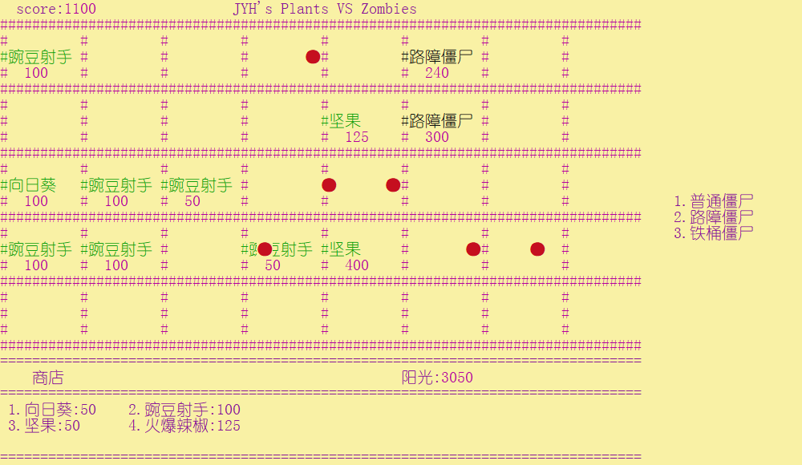

# 植物大战僵尸 CUI版

## 1	实现内容

- 庭院布局五行八列，其中第八列为僵尸预登场的地方，植物无法种植，子弹无法打到
- 实现三种僵尸：普通僵尸、路障僵尸、铁桶僵尸
- 实现四种僵尸属性：生命值、攻击力、攻击速度、移动速度
- 实现四种植物：向日葵、豌豆射手、坚果、火爆辣椒
- 实现四种植物属性：生命值、购买所费阳光数、攻击力、攻击速度
- 每块地块只会有一个僵尸或植物
- 普通僵尸、路障僵尸、铁桶僵尸，分别以3/5,1/5，1/5随机在庭院任意一列出现
- **按下键盘1,2,3,4进入向日葵、豌豆射手、坚果、火爆辣椒的选地皮环节**，地图中出现一个紫色的方块，表示当前地皮正在被选中，按下回车键，即将选中植物种植到当前地皮。若当前地皮存在僵尸或其他植物，则不会进行操作**（注：当前阳光数需多于购买植物所需阳光数）**
- 界面左上角为计分板，击杀普通僵尸加50分，击杀路障僵尸加100分，击杀铁桶僵尸加200分

`CUI`界面如图所示

注：**植物或僵尸下方数字代表当前生命值**



## 2	类的设计

本次课程设计中，类主要有`Game`类（IO与游戏逻辑）,`Base`抽象类(派生出各个植物和僵尸类)，`Bullet`类（子弹相关）。

`Base`类派生出`SunFlower`、`PeaShooter`、`Nuts`、`HotPepper`、`NormalZombie`、`ConeZombie`、`BucketZombie`七个类

`Base`类定义如下:

```C++ 
class Base
{
protected:
	int damage;		//攻击力
	int speed;		//速度
	int attackspeed;//攻击速度
	int price;		//购买需要阳光数
public:
    int life;		//生命值
	point pos;		//坐标
	int tag;		//标记植物或僵尸的类别
	Base(point p,int t=0);
	virtual ~Base();
	virtual void Action() = 0;   //每个植物或僵尸的特点/动作
};
```

其中包括一个**纯虚函数**，在派生类中实现，以表示植物和僵尸的道具或功能

其中成员变量`pos`表示该类在庭院矩阵中的位置，

成员变量`tag`用以区分植物和僵尸的类别，同时庭院矩阵一个点值就为该类tag值，方便交互与UI绘制

```C++
switch (coordinate[h][i])
{
    case 1:setColor(226); cout<< "#向日葵   "; break;
    case 2:setColor(226); cout << "#豌豆射手 "; break;
    case 3:setColor(226); cout << "#坚果     "; break;
    case 4:setColor(226); cout << "#火爆辣椒 "; break;
    case -1:setColor(224); cout << "#普通僵尸 "; break;
    case -2:setColor(224); cout << "#路障僵尸 "; break;
    case -3:setColor(224); cout << "#铁桶僵尸 "; break;
    default:
        setColor(237); cout << "#         "; break;
}
```

`Base`派生的植物中以豌豆射手为代表：

```C++
class PeaShooter :public Base
{
private:
	unsigned long long recordTick;	//时间时钟
public:
	PeaShooter(point pos, int t = 0);
	~PeaShooter();
	void Action();
};
```

相比于基类多增加了一个时间时钟，以实现攻击速度的实际价值。并具体实现了`Action`函数

`Base`派生的僵尸以普通僵尸为代表

```C++
class NormalZombie :public Base
{
private:
	unsigned long long recordTick;	//时间时钟
public:
	NormalZombie(point pos, int t = 0);
	~NormalZombie();
	void Walk();
	void Attack();
	void Action();
};
```

同样多增加了一个时钟类，并多增加了两个成员函数`Walk()`  `Attack()`，以表示移动和攻击，并在`Action`中调用两函数

`Bullet`子弹类尤其简单

```C++
class Bullet
{
private:
	point pos;//子弹坐标
	int damage;//伤害
public:
	friend class Base;
	friend class Game;
	Bullet(point p);
	~Bullet();
	void Action();//动作，改变子弹坐标，控制移动
};
```


